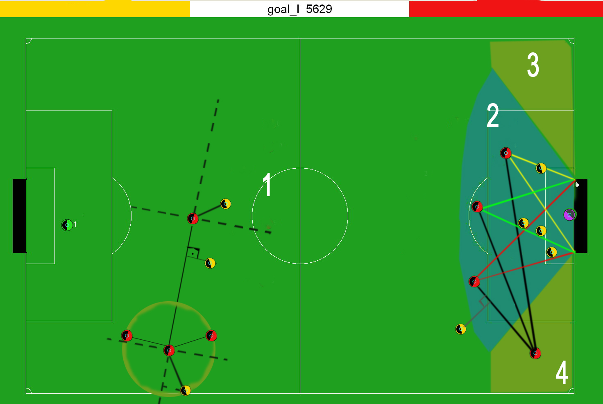

# RoboCap-2D-AI-Soccer-Team
RoboCap 2D is a project focused on developing artificial intelligence for managing a digital soccer team consisting of 2D robots. Implemented in C++ to run on Linux systems.

This project builds on existing code to develop a new method for identifying the best player to receive a pass in a soccer simulation.

- **Author**: Guilherme Lopes Borges
- **Paper PT**: [Link](assets/TDP_best_player_function.pdf)

## New Implementation

### Passing Strategy
The new method optimizes passing decisions by evaluating players in specific regions of the field. It includes:

- **Region 1**: `bestPlayerRegion1` selects the best player based on their proximity to an ideal position and potential interception by opponents.
- **Region 2**: `bestPlayerRegion2` considers the number of opponents in the vicinity and possible interceptions.

### Testing
The new method was tested with both static and dynamic player positions. Initial results confirmed the formula's effectiveness.

### Results
The method successfully identifies the best recipient for a pass, but additional enhancements are required to make a significant impact on match results.

## Acknowledgments

This project incorporates code from the following source:
- **Copyright (c) 2000-2003, Jelle Kok, University of Amsterdam**